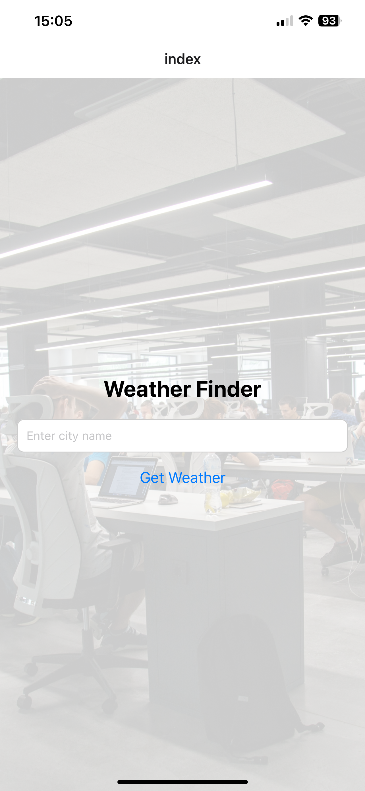
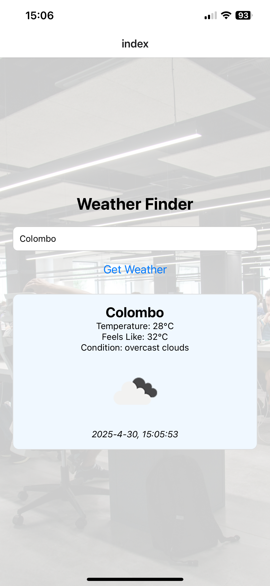

## Welcome to Weather Finder app 👋

  This is an [Expo](https://expo.dev) project created with [`create-expo-app`](https://www.npmjs.com/package/create-expo-app).

  A cross-platform mobile app built with React Native that allows users to search for real-time weather data by city name. It includes a backend GraphQL API powered by Apollo Server and Node.js.


## 📱 Features

- Search weather by city name
- Get temperature, feels like, condition, and weather icon
- Mobile-friendly UI built with React Native
- Real-time weather from OpenWeatherMap API
- GraphQL API backend to fetch and format weather data


## 🧰 Tech Stack

| Area      | Technology                | Purpose                           |
|-----------|---------------------------|-----------------------------------|
| Front-End | React Native              | Mobile UI framework               |
|           | JavaScript                | Programming language              |
|           | OpenWeatherMap API (REST) | Weather data                      |
|           | React Hooks               | State management                  |
|           | React Native Components   | UI layout and interaction         |
| Back-End  | Node.js                   | Server runtime                    |
|           | Apollo Server             | GraphQL API                       |
|           | GraphQL                   | API query language                |
|           | Axios                     | REST API request from server      |
|           | dotenv                    | Environment variable management   |
| Shared    | OpenWeatherMap API        | Weather data source               |


## 🚀 Get started!

1. Install dependencies

   ```bash
   npm install
   ```

2. Start the server

   ```bash
   node server.js
   ```

3. Start the app

   ```bash
    npx expo start
   ```

3. Use your local IP if testing on a device

   ```bash
    In apollo.js change IP address
   ```

## 📸 Screenshots

<div style="display: flex; gap: 50px; justify-content: center; margin: auto;">
  
  
</div>


In the output, you'll find options to open the app in a,

- [development build](https://docs.expo.dev/develop/development-builds/introduction/)
- [Android emulator](https://docs.expo.dev/workflow/android-studio-emulator/)
- [iOS simulator](https://docs.expo.dev/workflow/ios-simulator/)
- [Expo Go](https://expo.dev/go), a limited sandbox for trying out app development with Expo


## Get a fresh project

When you're ready, run:

```bash
npm run reset-project
```

This command will move the starter code to the **app-example** directory and create a blank **app** directory where you can start developing.

## Learn more

To learn more about developing your project with Expo, look at the following resources:

- [Expo documentation](https://docs.expo.dev/): Learn fundamentals, or go into advanced topics with our [guides](https://docs.expo.dev/guides).
- [Learn Expo tutorial](https://docs.expo.dev/tutorial/introduction/): Follow a step-by-step tutorial where you'll create a project that runs on Android, iOS, and the web.


